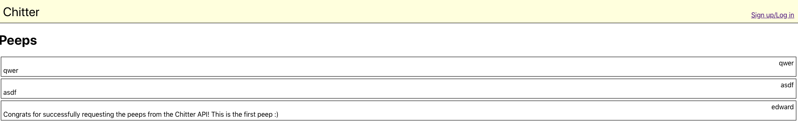

# Chitter API Frontend Challenge


Challenge:
-------

We are going to write a small Twitter clone that will allow the users to post messages to a public stream.

The scenario is similar to the [Chitter Challenge](https://github.com/makersacademy/chitter-challenge), except someone has already built a backend API for you and hosted it on Heroku.

Your task is to build a front-end single-page-app to interface with this API. You can do this in any framework you like, or in pure Javascript. [The API documentation is here.](https://github.com/makersacademy/chitter_api_backend)

Here are some interactions the API supports. Implement as many as you see fit.

* Creating Users
* Logging in
* Posting Peeps
* Viewing all Peeps *(I suggest you start here)*
* Viewing individual Peeps
* Deleting Peeps
* Liking Peeps
* Unliking Peeps

# My approach

My main goal when working through this challenge was to use to learn the basics of React with hooks. As I had never used React before, this meant that I had no expectations of how far I would get through the various user stories, but that I would hopefully learn a huge amount however far I got.

For testing I chose to use the React testing library rather than Enzyme. I was interested in what seemed to be a simpler, more light-weight approach and API.

## Getting started

```bash
# clone the repository to your local machine with either

# if you're using ssh
git clone git@github.com:PhilipVigus/frontend-api-challenge.git

# if you're using https
git clone https://github.com/PhilipVigus/frontend-api-challenge.git

# Dependencies
# The repository requires node, which can be installed with the following commands
brew update
brew install node

# then run npm install from the project root directory
npm install
```

## Running the app

```bash
# to start the app
npm start
```

## Testing the app

```bash
# To run all tests
npm test
```

## My implementation

### Use create-react-app to set up a skeleton react project

React comes with an extremely helpful utility that sets up a working 'hello-world'-like application for you. It is run with:
```bash
npx create-react-app <app-name>
```
and provides a number of npm scripts that allow you to run and test your project.

### Set up eslint

I then set up eslint to work with the various libraries I was using. This required the addition of various plugins so that eslint recognised all of the syntax I was using.

### Viewing all peeps

I created a simple Peep component to display a single Peep, initially with values hard-coded. I then created a PeepList component to render a list of the Peep components. Working out how to connect this up to the server API correctly was extremely challenging, and it was even more difficult to mock the calls to the api so that I could effectively test the components. I ended up having to:

- upgrade the testing-library/react package
- add jest-fetch-mock and a mutation observer shim as described here:- https://github.com/testing-library/dom-testing-library/releases/tag/v7.0.0. (For some reason their recommended solution did not work for me)
- add the mutation observer shim to the global window
- convert the test to properly run asynchronously

### Adding peep authors and styling

I did this next to learn how to style React components. I found this suprisingly straightforward and enjoyable.

### Signing in and logging in

This took up the remainder of my time. I had to

- work out how to use hooks to manage the form for signing and logging in
- create the POST request correctly
- understand how to handle correct and incorrect sign up and log in requests
- work out how to respond to those requests
- implement a solution using React Router so that the links and buttons worked correctly

This was hard. Really, really hard. I managed to implement everything except how to store the response to a successful log in attempt for use by other parts of the application.

## Challenges

### React

The obvious challenge, and why I approached it the way I did, was to learn a new framework while building the application.

I found the subtlties in syntax difficult to understand and first, particularly the JSX, and using hooks was initially extremely counterintuitive to me.

I eventually came to a halt trying to work with contexts in a way that would allow the application to know when someone was logged in and be able to log people in and out. I got as far as creating and accessing the context, but could not work out how to update its values. This was a shame, as it meant I was unable to implement features that relied on the user being logged in.

### Testing

Alongside that I had to learn a new test framework. What I thought looked like a relatively simple API proved to be far more complex than I anticipated. 

- successfully mocking fetch api calls took me a long time to get right. I ended up using a third-party library to simplify things a little.
- just correctly using the right matchers in the right places, and manipulating the results was also difficult
- I had never really worked with asynchronous tests before, and I initially didn't really understand the differences and what that meant to how I needed to write the tests.

Due to the above I found it difficult to adhere strictly to test-driven development. At times I had no idea how to implement a particular thing , what a test's inputs and outputs should be, or even what exactly I should be testing. As a result, I ended up doing a lot of 'spiking' - writing fast and dirty code to understand an implementation, before writing the test. 

Towards the end of my time on the challenge things started to click though, and I felt I was properly following the TDD process of writing failing tests before making them pass.

## Future work

I thoroughly enjoyed the parts of React I learned doing this challenge, and I fully intend to come back to it to complete the implementation. There is obviously still a lot to do, but I'm extremely proud of how much I learned and what I was able to get done in such a short (12 hours) timeframe.