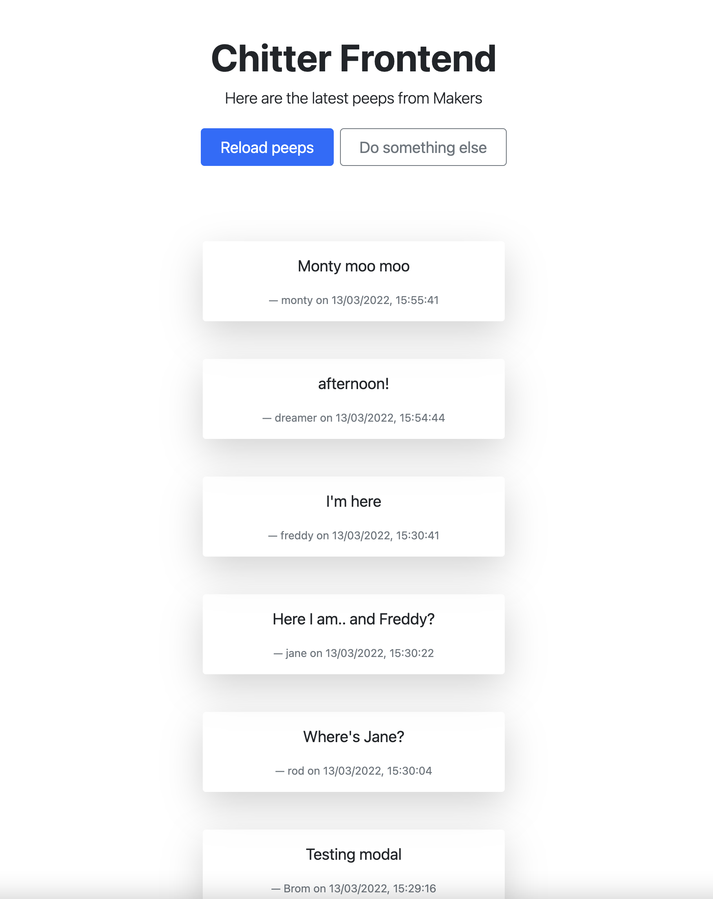

# Chitter API Frontend Challenge

A front-end single-page-app that interfaces with [the pre-built "Chitter" API](https://github.com/makersacademy/chitter_api_backend).
This small Twitter clone should allow users to post messages to a public stream.

Implemented interactions supported by the API
-------

- [x] Viewing all Peeps.
    - [x] Display author of Peep.
    - [x] Display date and time of Peep, formatted from ISO to locale.
- [ ] Viewing individual Peeps.
- [ ] Creating Users.
- [ ] Logging in.
- [ ] Posting Peeps.
- [ ] Deleting Peeps.
- [ ] Liking Peeps.
- [ ] Unliking Peeps.

Notes
---

- Test coverage is low as I struggled to keep a TDD approach.
- `peepsView.test.js` fails due to the introduction of the API component.
- Most of the `Model` methods (`getPeeps`, `addPeep` and `reset()`) are not actually needed, and they are there as I built the first version following the Notes app tutorials.
- Played around a bit until I managed to pull the list of peeps. Then played some more to display nested data (author, date).
- Will try implement authenticationa and POST requests to the API in the future.
- Added basic Bootstrap styling.

