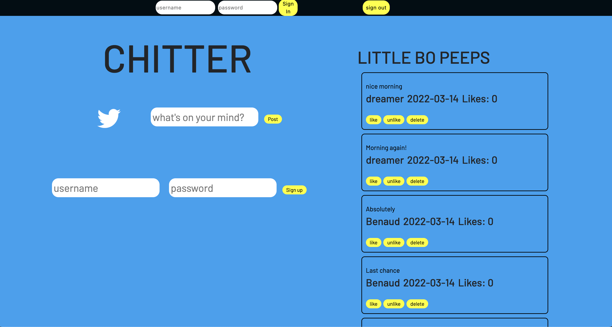

# Chitter API Frontend Challenge

An imitation Twitter website built using  vanilla javascript and ESBuild. Currently in the development phase and avaiable on a local server.

# Requirements

Please ensure node.js is installed

# Run Chitter

- to install the code run ```git clone https://github.com/eddiearnoldz/frontend-api-challenge.git```
- run the command ```npm install``` in the root directory.
- run the command ```npm run build```
- if you have LiverServer for VS code then load it with the index.html page. 
  otherwise copy the path of index.html and open in the Chrome or the browser of your choice.

# Screenshot




