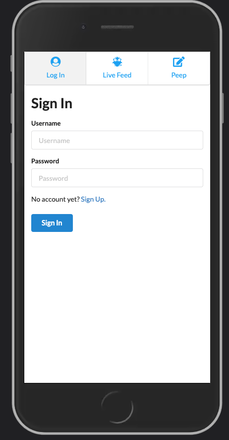
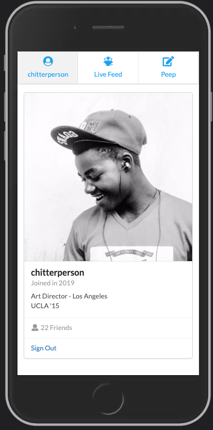
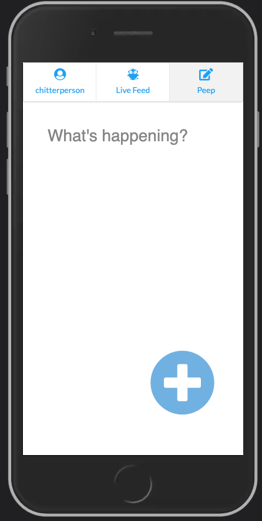
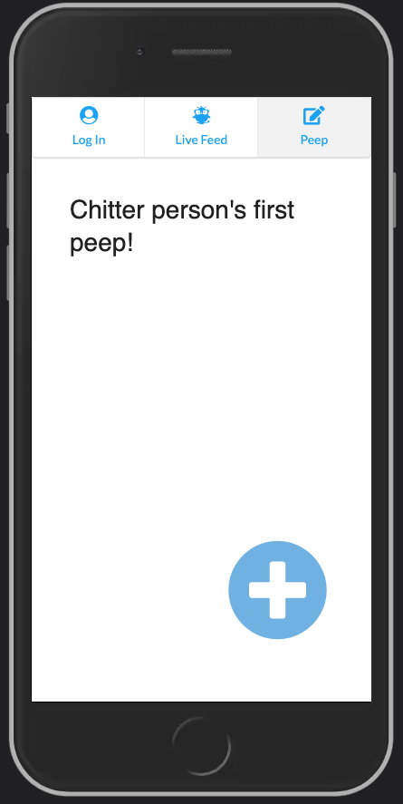
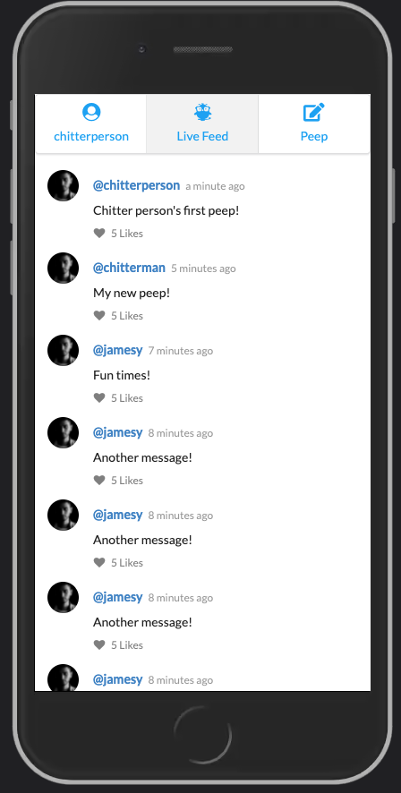

# Chitter API Frontend Challenge

Challenge
----------

**Write a small [Twitter clone](https://chitter-app.vercel.app) that will allow the users to post messages to a public stream.**

[>> Visit Chitter App](https://chitter-app.vercel.app)

## Undertaking

Built a clean, mobile-friendly front-end twitter clone which implements the following features:

* Creating Users (Sign Up)
* Logging in
* Posting Peeps
* Viewing all Peeps

Directed requests to a [Pre-existing backend API](https://github.com/makersacademy/chitter_api_backend) built on express server, and integrated responses into a hooks-based react application.

Used state and effect hooks to control the flow of information between components, and to conditionally render components for minimal reloading and enhanced user experience.

Adopted a TDD approach to reduce bugs and ensure app stability.

Sign In Page       |     Signed In     |    Peep Page
:-------------------------:|:-------------------------:|:-------------------------:
  |  ![]  |  

  Write Peep      |     Feed
:-------------------------:|:-------------------------:
 | 

## Technologies

### Production

* React - front-end framework
* Semantic UI - CSS library

### Testing

* Jest - JavaScript testing framework
* React Testing Library - React component testing library
* Mock Service Worker - API mocking library

### Deployment

* Vercel - automatic deployment solution

## Challenges & Solutions

*Whether caused by fundamental misunderstanding of the tools or simple oversights, each bug taught a valuable lesson*

**Errors in test and behaviour when setting state on unmounted components**

* Completly restructured how alerts are called and cancelled, moving control of the alert (esp. setTimeOuts) to the alert component rather than the component which initiates the alert
* Generally took care to set states before rendering the next view
* Simply reordering and rearranging lines of code in some cases

**Problems accessing and rendering local storage data after reload**

* Remember to call JSON.parse() when getting items from local storage 😅

**Difficulty interecpting HTTP requests with Mocking Service Working and producing meaningful tests without accessing the database**

* Reading the docs, going through various tutorials (as with any new tool).
* Focused on testing what the user would see based on their use of the app (wherever possible)

**Several errors when testing asynchronous behaviour within tests**

* Docs, tutorials, stackoverflow and taking guidance from error messages in console
* Heavy use of console.log() to understand what code was running and when. Also, to detect unresovled asynchronous operations.
* Utilize more features and syntax of testing library

**Difficulty interacting with the api endpoints created by a third party**

* Reading axios docs, use of postman and using trial and error to format requests appropriately

## Learnings

* Although most of the async test errors didn't impact functionality, they exposed bad practices and potential memory leaks that could cause problems down th line. Debugging them was well worth the time and helped with overall code design and knowledge of react testing library.

* Adopt a user-centric approach to front-end testing (instead of testing state), prioritising the appropriate behaviour of high value features. Design tests to simulate how a user would actually use the app.

* Design modular components that control their own fate as much as possible. This makes it easier (and leads to fewer bugs) when guiding information through more complicated routes (e.g. from child - to parent - to child)

## Potential Improvements & Extensions

* Write JSX to enable selecting more elements by 'role' (keeping use of data-testid to a minimum)

* Utliize a wider range of hooks which may help to simplify overall code design

* End-to-End testing using cypress library

* Add more alerts to take full advantage of this component

* Implement additional features based on the remaining API endpoints:

1. Viewing individual Peeps
2. Deleting Peeps
3. Liking Peeps
4. Unliking Peeps
