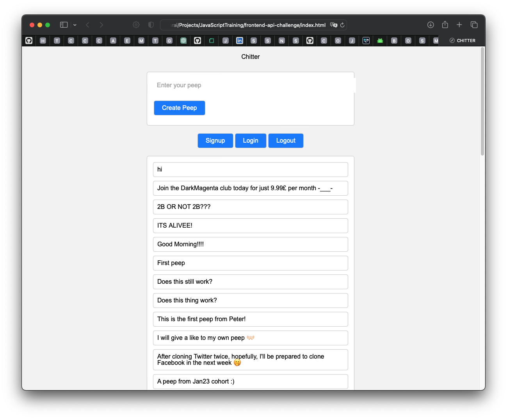

# Chitter API Frontend Challenge

This is a small Twitter clone that allows users to post messages to a public stream. The backend API is already provided and hosted on Heroku. The task is to build a front-end single-page application (SPA) to interface with the API.

## Screenshot

## Ruby Version

If you're interested in an alternative implementation of this project using Ruby, you can check out the [Ruby version](https://github.com/Shakhrai8/cyber-twitter).

The Ruby version includes both the backend and frontend components, and utilizes a database for data storage. It provides similar features to the JavaScript version, allowing users to create accounts, post peeps, view and delete peeps, and more. Feel free to explore and compare the two implementations.

## Features

The application includes the following features:

- Creating users
- Logging in
- Posting peeps
- Viewing all peeps
- Viewing individual peeps
- Deleting peeps
- Liking peeps
- Unliking peeps

## Technologies Used

The application has been developed using the following technologies:

- JavaScript
- Jest (for testing)
- HTML
- CSS
- Apis

## Installation

To run the application locally, follow these steps:

1. Clone the repository: `git clone https://github.com/Shakhrai8/frontend-api-challenge.git`
2. Navigate to the project directory: `cd frontend-api-challenge`
3. Install the dependencies: `npm install`
4. Build the application: `npm run build`
5. Open the application: Open the `index.html` file in your preferred browser.

## Usage

Once the application is running, you can perform the following actions:

1. **Creating Users**: Use the provided user interface to sign up and create a new user account.
2. **Logging In**: Use the provided user interface to log in to your account.
3. **Posting Peeps**: Enter your peep text in the input field provided and click the "Post Peep" button to post a new peep.
4. **Viewing All Peeps**: The application displays all the peeps in the public stream. Scroll through the peeps to view them.
5. **Viewing Individual Peeps**: Click on a peep to view its details, such as the peep content, creation date, author, and number of likes.
6. **Deleting Peeps**: If you are the owner of a peep, a delete button will be displayed when viewing the peep details. Click the delete button to remove the peep.
7. **Liking Peeps**: When viewing the details of a peep, click the "Like" button to like the peep.
8. **Unliking Peeps**: If you have already liked a peep, the "Like" button will be changed to "Unlike". Click the "Unlike" button to remove your like from the peep.

## Testing

The application has been thoroughly tested using Jest to ensure its functionality and reliability. To run the tests, execute the command `jest`.
