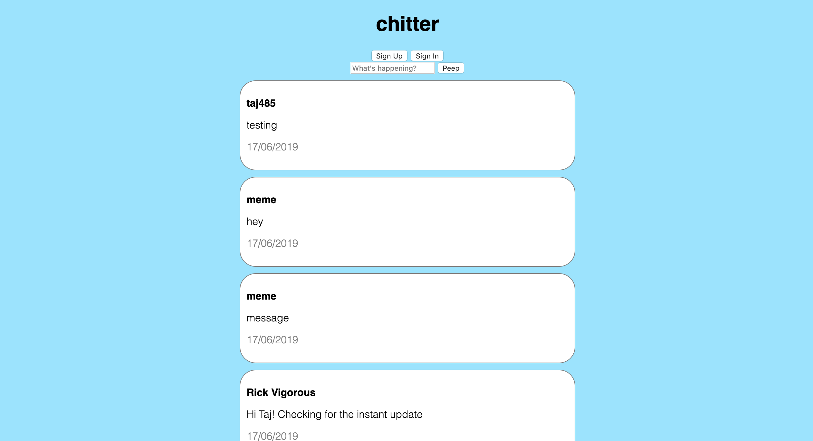

# Chitter API Frontend Challenge

Goal: to create a single-page twitter clone, practicing using JavaScript and a RESTful API.

[Deployed on surge.](http://guiltless-wine.surge.sh/)

## How to use

* Clone this directory

* Open index.html to interact with the app. Sign up, sign in, and post peeps!

* To run tests open spec/specRunner.html and check the browser console for messages

## Challenge:

Similar to the previously completed [Chitter Challenge](https://github.com/LaurenceTaylor/chitter-challenge), this time in Javascript and using a RESTful API instead of a local database.

Feature list:

* Creating Users
* Logging in
* Posting Peeps
* Viewing all Peeps
* Viewing individual Peeps
* Deleting Peeps
* Liking Peeps
* Unliking Peeps

## Approach

* Built a (very) rudimentary testing framework during the [notes app](https://github.com/n3ttl3t/notes_js) challenge last week. Thought it would be wasteful not to make use of it here! 'Describe' and 'it' blocks would have been nice to have, but after speaking with a coach they were deemed low priority.

* TDD approach - red, green, refactor.

* Constructing a single-page web app (no page refreshes allowed) was a challenge. I opted to store each 'page' within divs to show/ hide as appropriate. preventDefault was used to prevent form submits from redirecting.

* Connected to the API using vanilla JavaScript. Used jQuery to hide/ show elements. This approach felt a little inconsistent, though I prioritised getting the code working first. It would be nice to refactor.

## Thoughts

* As mentioned it would be nice to refactor (include more jQuery?). Parts of the code are verbose (especially interacting with the API) and could surely be DRYed up.

* Missing a few features here: viewing individual peeps, deleting peeps, liking and unliking peeps.

* Testing coverage feels a little sparse. Was unsure of how best to test this app, with it being mostly front-end. My previous experience has been with unit tests for the model in the MVC pattern.

* Would be fun to expand the testing framework further, but ran out of time this weekend.

* Improvements to CSS would be nice to have.
