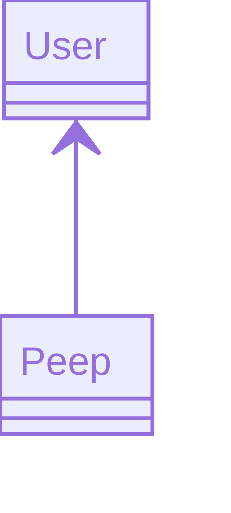

# Chitter Challenge
# Makers Week 7

## Specification

### Task

Create a frontend for the Makers [chitter api](https://github.com/makersacademy/chitter_api_backend)

### User Stories

> **1.**

> As any user

> So that I can enjoy a feeling of [weltschmerz](https://en.wikipedia.org/wiki/Weltschmerz)

> I would like to be able to view all the peeps

> **2.**

> As any user

> So that I can really focus my anger

> I would like to be able to view an individual peep

> **3.**

> As a logged in user

> So that people know I like the correct things

> I would like to like a peep

> **4.**

> As a logged in user

> In case I accidentally liked an incorrect thing

> I would like to unlike a peep

### Models

### Implementation
