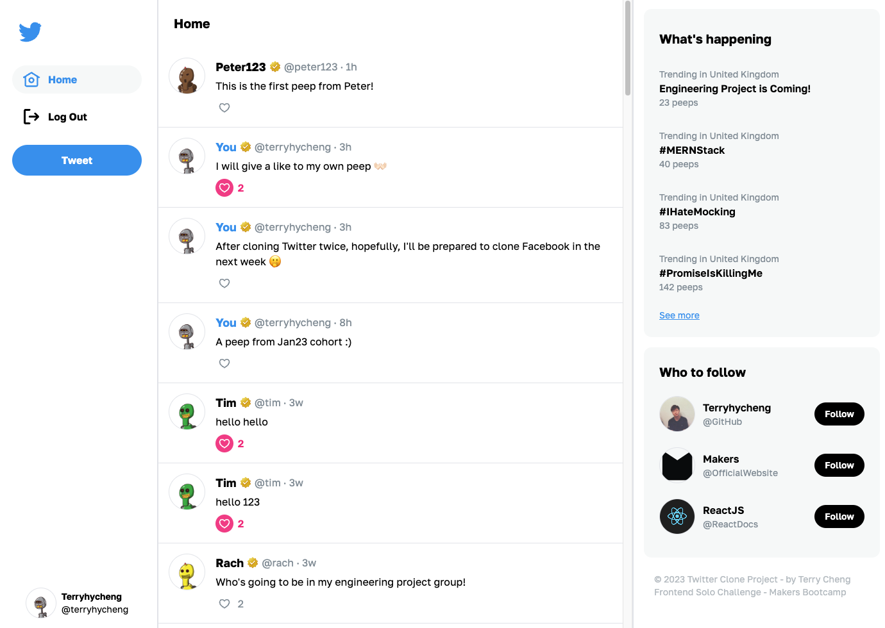

<a name="readme-top"></a>

<br />
<!-- PROJECT LOGO -->
<div align="center">
  <a href="https://github.com/terryhycheng/frontend-api-challenge">
    
  </a>

<h3 align="center">Chitter in <strong>ReactJS</strong> & <strong>Typescript</strong></h3>
<p>A Scalable ReactJS Twitter Clone with Type-Safety and User-Friendly Design</p>

  <p align="center">
    <a href="https://frontend-api-challenge-ten.vercel.app/">View Demo</a>
    ·
    <a href="https://github.com/terryhycheng/frontend-api-challenge/issues">Report Bug</a>
    ·
    <a href="https://github.com/terryhycheng/frontend-api-challenge/issues">Request Feature</a>
  </p>
</div>

<!-- TABLE OF CONTENTS -->

## Table of Contents

- [Table of Contents](#table-of-contents)
- [About The Project](#about-the-project)
  - [Key Features](#key-features)
  - [Built With](#built-with)
- [Getting Started](#getting-started)
  - [Prerequisites](#prerequisites)
  - [Installation](#installation)
  - [Running Tests](#running-tests)
  - [Production Build](#production-build)
- [Contributing](#contributing)
- [Contact](#contact)

<!-- ABOUT THE PROJECT -->

## About The Project



Chitter is a **Twitter clone app** built with cutting-edge technologies including **ReactJS, TypeScript, and TailwindCSS**, featuring a user interface similar to Twitter.

The project showcases the effectiveness of **TypeScript** in building a **type-safe, well-tested** application. Custom hooks were developed to handle data fetching and form submission, and the app includes comprehensive **end-to-end** and **unit tests** using **Cypress and Jest**.

Overall, this project represents a significant achievement in my development career, showcasing my expertise in building scalable and maintainable front-end applications using the latest technologies and development practices.

<p align="right">(<a href="#readme-top">back to top</a>)</p>

### Key Features

- ✅ User registration and login
- ✅ Ability to create, view, and delete peeps (tweets)
- ✅ Ability to like and unlike peeps
- ✅ Custom hooks for data fetching and form submission
- ✅ User interface based on the real Twitter for a familiar experience

<p align="right">(<a href="#readme-top">back to top</a>)</p>

### Built With

This project was built with the following tools:

- [![React][react-shield]][react-url]
- [![Typescipt][typescript-shield]][typescript-url]
- [![tailwindcss][tailwindcss-shield]][tailwindcss-url]
- [![Cypress][cypress-shield]][cypress-url]
- [![Jest][jest-shield]][jest-url]

<p align="right">(<a href="#readme-top">back to top</a>)</p>

<!-- GETTING STARTED -->

## Getting Started

This section shows you how to set up this project locally. First, get a local copy up and running follow these simple steps.

### Prerequisites

You have to make sure that `npm` and `node` have been installed in your local machine before running the project. If not, follow the steps below.

- npm

  ```sh
  npm install npm@latest -g
  npm -v
  ```

- nvm & node
  ```sh
  # visit https://github.com/nvm-sh/nvm on how to install nvm
  nvm install node
  node -v
  ```

---

### Installation

1. Clone the repo
   ```sh
   git clone https://github.com/terryhycheng/frontend-api-challenge.git
   cd frontend-api-challenge
   ```
2. Install NPM packages

   ```sh
   npm install

   # OR

   yarn
   ```

<p align="right">(<a href="#readme-top">back to top</a>)</p>

---

### Running Tests

Before compiling the codes into production-ready Javascript, you should run the tests and make sure every line can be run without causing any errors.

1. Run Jest tests

   ```sh
   npm run test

   # OR

   yarn test
   ```

2. Run Cypress tests

   Please make sure the dev server is serving the front-end before running the following commands.

   ```sh
   # run cypress tests without GUI
   cypress run


   # with GUI
   npm run cypress

   # OR

   yarn cypress
   ```

Then, test coverage reports will be automatically generated in the folder `coverage`. You can modify the setting in `package.json` to remove the command `--coverage`.

<p align="right">(<a href="#readme-top">back to top</a>)</p>

---

### Production Build

This project was built with `Typescript`. You can use `Vite` command to covert all TS codes into JS before passing to deployment.

1. Build with Typescript

   ```sh
   npm run build

   # OR

   yarn build
   ```

All production-ready Javascript codes will be put in the folder `dist`.

<p align="right">(<a href="#readme-top">back to top</a>)</p>

<!-- CONTRIBUTING -->

## Contributing

Contributions are what make the open source community such an amazing place to learn, inspire, and create. Any contributions you make are **greatly appreciated**.

If you have a suggestion that would make this better, please fork the repo and create a pull request. You can also simply open an issue with the tag "enhancement".
Don't forget to give the project a star! Thanks again!

1. Fork the Project
2. Create your Feature Branch (`git checkout -b feature/AmazingFeature`)
3. Commit your Changes (`git commit -m 'Add some AmazingFeature'`)
4. Push to the Branch (`git push origin feature/AmazingFeature`)
5. Open a Pull Request

<p align="right">(<a href="#readme-top">back to top</a>)</p>

<!-- CONTACT -->

## Contact

Terry Cheng - [@terryhycheng](https://twitter.com/terryhycheng) - terryhycheng@gmail.com

Project Link: [https://github.com/terryhycheng/frontend-api-challenge](https://github.com/terryhycheng/bowling-challenge)

<p align="right">(<a href="#readme-top">back to top</a>)</p>

<!-- MARKDOWN LINKS & IMAGES -->
<!-- https://www.markdownguide.org/basic-syntax/#reference-style-links -->

[typescript-shield]: https://img.shields.io/badge/Typescript-3178c6?style=for-the-badge&logo=typescript&logoColor=white
[typescript-url]: https://www.typescriptlang.org/
[circleci-shield]: https://img.shields.io/badge/circleci-000000?style=for-the-badge&logo=circleci&logoColor=white
[circleci-url]: https://circleci.com/
[jest-shield]: https://img.shields.io/badge/jest-c21325?style=for-the-badge&logo=jest&logoColor=white
[jest-url]: https://jestjs.io/
[react-shield]: https://img.shields.io/badge/reactjs-20232a?style=for-the-badge&logo=react&logoColor=61dafb
[react-url]: https://reactjs.org/
[cypress-shield]: https://img.shields.io/badge/cypress-007780?style=for-the-badge&logo=cypress&logoColor=white
[cypress-url]: https://www.cypress.io/
[tailwindcss-shield]: https://img.shields.io/badge/tailwindcss-0f172a?style=for-the-badge&logo=tailwindcss&logoColor=38BDF8
[tailwindcss-url]: https://tailwindcss.com/
