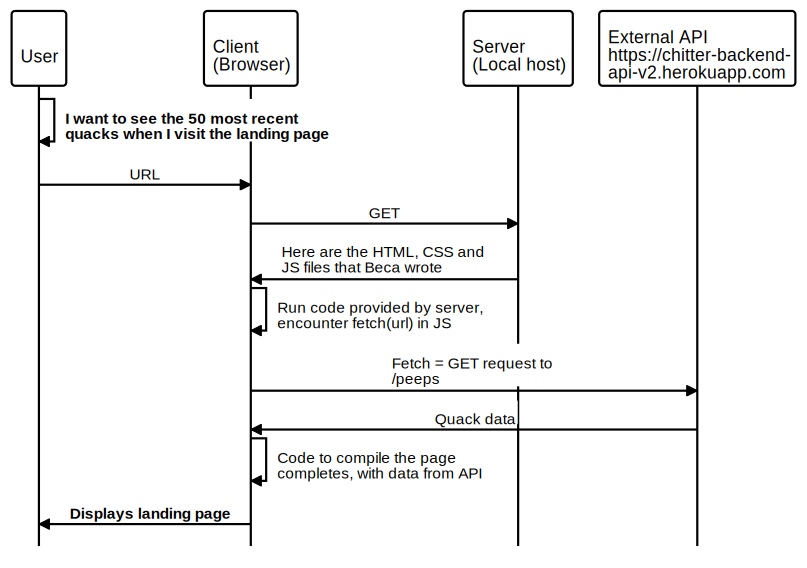

# Chitter API Frontend Challenge
[INSERT SCREEN SHOT WHEN AVAILABLE]

## What does the code do?

A small Twitter clone that allows users to post messages to a public stream.

The scenario is similar to the [Chitter Challenge](https://github.com/makersacademy/chitter-challenge), except it uses a pre-existing backend API.

## Training focus for this challenge

My aim this weekend is to build a front-end single-page-app to interface with an external API. 
[The API documentation is here.](https://github.com/makersacademy/chitter_api_backend)

I chose this challenge to get more practice with:
 - Javascript SPAs
 - External API integration
 - User login / authentication

Here's a model of how I planned the entities to interact to load the landing page:

## Features

### User stories worked on so far

* Viewing all Peeps

### Next steps / Future features

* Creating Users
* Logging in
* Posting Peeps
* Viewing individual Peeps
* Deleting Peeps
* Liking Peeps
* Unliking Peeps

## How to install
1. Clone the repo: `git clone https://github.com/BecaLParker/frontend-api-challenge`
2. cd to directory frontend-api-challenge

You can run the testing ....
 - open SpecRunner.html in a browser

Interact as a user by ...
 - open index.html in a browser and follow the onscreen instructions

## Credits
* [allymparker](https://github.com/allymparker) for discussing my entity sequence diagram during planning, and for explaining promises (extracting methods that return promises, testing promises)
* [The Fetch API](https://developer.mozilla.org/en-US/docs/Web/API/Fetch_API/Using_Fetch) for making requests.
* [Postman](https://www.getpostman.com/) or [Insomnia](https://insomnia.rest/) for exploring the API.
