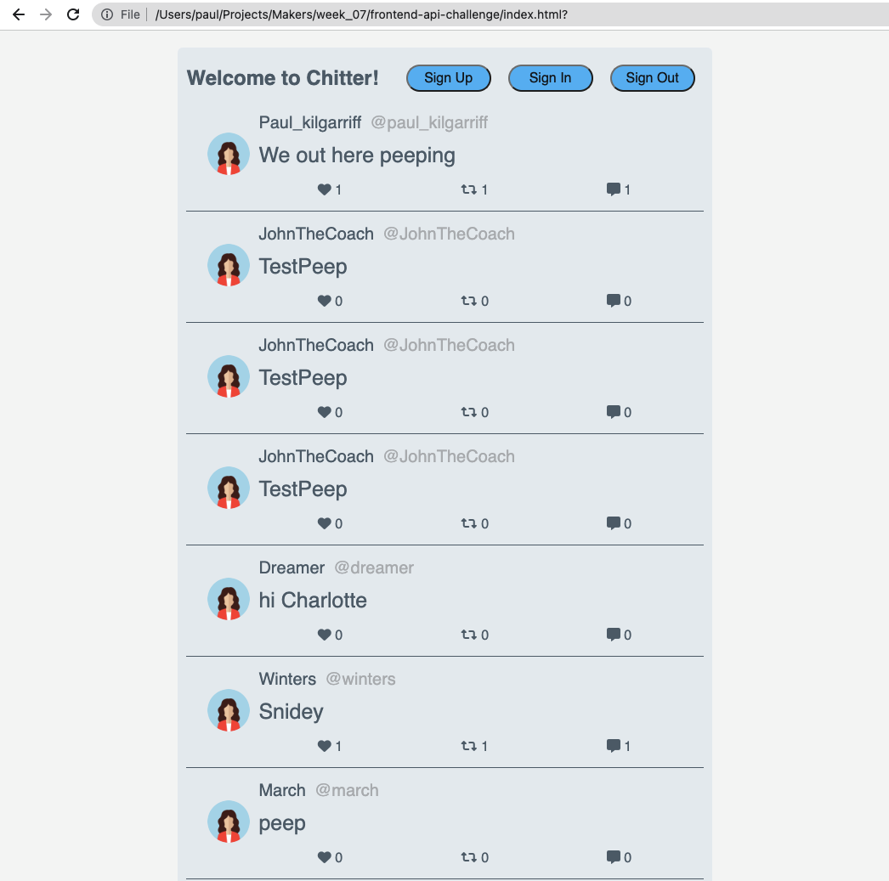
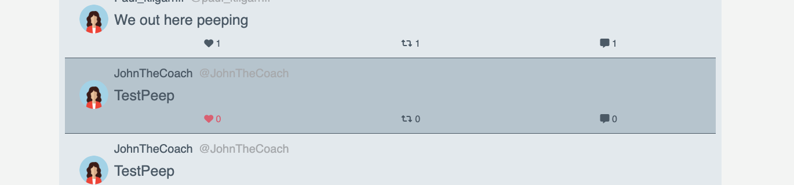
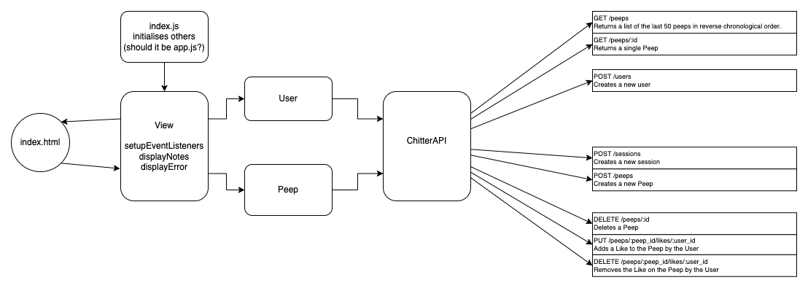

# Chitter API Frontend Challenge

## Description

Implement a frontend in JavaScript for a backend application that allows users to interact with a database of 'peeps'

This is the current view of the app after the peeps have loaded.

The peep container and the symbols beneath each peep change colour on hover, and register a click through jQuery event handlers.

## Approach

- Followed the steps in the [Makers Pill](https://github.com/makersacademy/javascript-web-applications/blob/main/pills/setup_minimal_frontend_webapp.md) to set-up a minimal frontend application.
- Diagrammed a [topline overview](#initial-overview-of-app-flow) of the interactions between front and back end.
- Created [User Stories](#user-stories) for the suggested interactions & related functions
- Analysed User Stories for domain modelling
  - extracted objects and actions
- Test-drove chitterApi class
  - installed jest-fetch-mock
  - add getPeepsFromServer method
  - mocked calls to fetch for getPeepsFromServer
- Test-drove chitterModel class
  - add loadNotes method -> maps response from ChitterAPI to local object
- Test-drove chitterView class
  - add displayPeeps method
  - extracted repeated parts to generatePeep method
  - add displayButtons method
- Spent time with the styling of the page
  - added styles.css
  - used examples from:
    - Previous work on [ScareBNB Makers project](https://github.com/adamwoodcock98/makersbnb)
    - [Online Twitter Clone Demo](https://github.com/somanath-goudar/html-css-projects/tree/master/twitter-clone)
    - [Codecademy CSS Course](https://www.codecademy.com/learn/learn-css)
  - Page now has a login form that slides into view based on a jQuery event handler
  - Peeps load (slowly) with a placeholder avatar image, the handle of the author, and the peep body
  - Peeps also have a footer that contains FontAwesome symbols to represent likes, repeeps, and comments
    - these change colour when hovering -> CSS pseudoelements
    - the icons and numbers aren't quite linked currently (can change colour independently)

> BLOCKER: I don't know how to save session information in a JavaScript frontend
>
> - This is preventing any dynamic loading of the sign in/up/out buttons
> - Along with blocking off page interaction to logged-in users

## Next Steps

- I would like to know how to save session data in this type of app
  - would allow me to implement the Session and Authorised User sections of the user stories
- I would like to use Bootstrap more effectively to create an anchored navbar at the top of the page that moves with the view
- I would be interested in swapping the sliding login form for a modal login form that pops up over the rest of the page
- I would like to introduce the User class
  - initial thought would be that it is separate from peeps, but contains references t the users peeps
  - would explore this through diagramming

---

# Appendix

## Technologies Used

- JavaScript (Node.js)
- jQuery
- Fetch -> making the API requests within the program
- Jest (Current Coverage: 92.3%)
  - special shoutout to the incomprehensible mocking while modifying the DOM
- BootStrap | FontAwesome - external stylesheets
- ~Travis CI~ -> Couldn't get Jest working reliably enough locally to involve CI
- Postman -> for exploring the backend API

## User Stories

> As a Chitter user 
> So that I can keep track of the thoughts of the world 
> I would like to _view a list_ of the last 50 **peeps** posted to Chitter 

> As a Chitter user 
> So that I can really focus on the meaning of a peep 
> I would like to _view a single_ **peep** by itself 

> As an unregistered user 
> So that I can participate in the online conversation 
> I would like to \*make an **account\*** on Chitter 

> As a Chitter user 
> So that only I can interact as myself on Chitter 
> I would like to _log in_ to my **account** on Chitter 

> As a logged-in Chitter user 
> So that I can swithc off occasionally 
> I would like to _log out_ of my **account** on Chitter 

> As a Chitter User 
> So that I can share my thoughts with the world 
> I would like to _post_ a **peep** to Chitter 

> As a Chitter User 
> So that I don't have to defend my incoherent ramblings from the past 
> I would like to be able to _delete_ one of my **peeps** 

> As a Chitter User 
> So that I can express my joy at another user's peep 
> I would like to be able to _add a like_ to a **peep** 

> As a Chitter User 
> So that I can make a stranger on the internet feel bad 
> I would like to be able to _unlike_ a **peep** that I previously liked 

## Diagrams

### Initial Overview of App Flow

